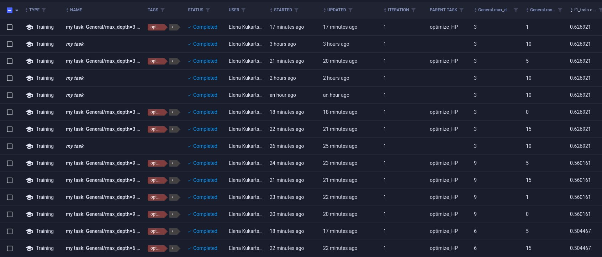
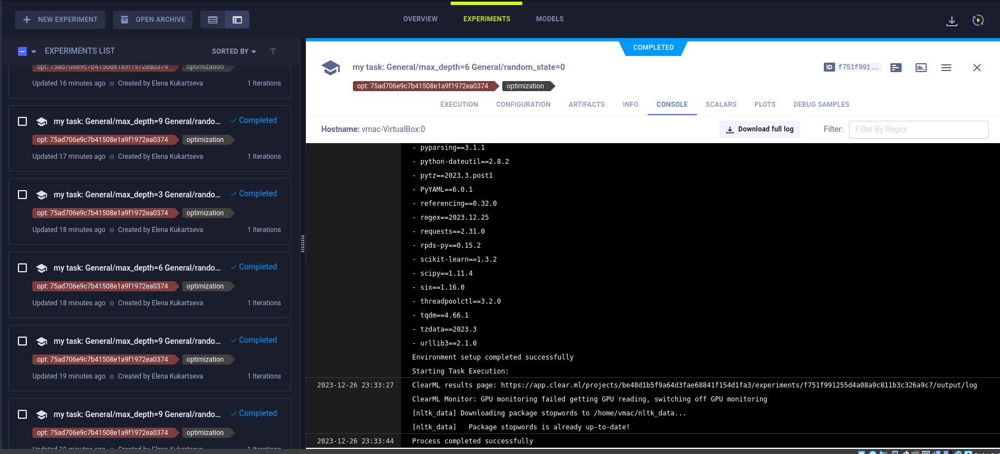

# laba4
# laba4
- Выбрать один из пройденных инструментов автоматизации процесса машинного обучения (DVC/ClearML / MLFlow / Airflow)
- Реализовать процесс обучения модели
- Определить решаемые экспериментом задачи
- Пояснить цель и ход своих экспериментов
- Прикрепить скриншоты созданных задач в выбранном инструменте, файлы скриптов  по работе с данными и обучению модели, а также файл с небольшим пояснением содержимого экспериментов.
## Список команды
- Кукарцева Елена Сергеевна, РИМ-220908
- Калимуллина Алина Рафиковна, РИМ-220908
- Плотников Григорий Александрович, РИМ-220908
## Инструмент
В качестве инструмента был выбран ClearML.
## Задача
Была выбрана задача оптимизации гиперпараметров модели, которая должна предсказывать наличие упоминаний чрезвычайных ситуаций (пожар, наводнение, цунами и др.) в тексте твита. Цель - получить максимально возможную наивысшую метрику F1.
## Данные и модель
В качестве метода для извлечения признаков был выбран TF-IDF. Данные взяты из соревнования "Natural Language Processing with Disaster Tweets" на kaggle.
## Эксперименты и результаты
Было выполнено несколько экспериментов. В ходе подбора гиперпараметров, наилучшим результатом эксперимента была метрика F1 = 0.626921.
Более хорошего результата можно добиться на большем количестве эпох, но в виду долгого обучения и подбора гиперпараметров, остановились на экспериментах в рамке одной эпохи.
## Скриншоты задач и экспериментов
Выполненные эксперименты

Одна из успешных итераций оптимизатора 
